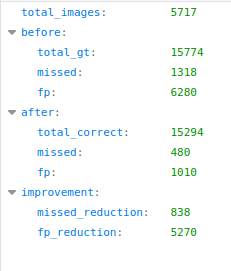
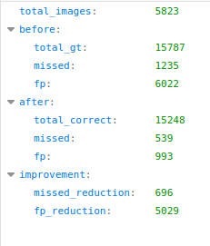

# Feature prompt for SAM 3

# 纯视觉提示
SAM3具有出色的泛化性能，但是仍难免出错，其本身具有visual prompt 能力，但是SAM3的visual prompt 跟当前图像高度捆绑，
其visual prompt主要有所选框的是视觉特征，所选框的位置特征组成，为了验证其纯视觉特征对目标检测效果仍然是有提升的，我去掉
了SAM3中visual prompt中的框位置特征，只保留了视觉特征，在VOC上针对漏检、误检特征添加纯视觉提示，结果证明是有一定提升的。

   
上图分别为训练集和测试集的VOC结果，分别统计了添加视觉提示前和添加视觉提示后的误检漏检情况，可以发现添加
视觉提示后误检、漏检情况变少。

纯视觉提示通过设置boxes_pos_enc=False与boxes_direct_project=False实现,具体位于 `sam3/model_builder.py` 的第 283-300 行

```python
    input_geometry_encoder = SequenceGeometryEncoder(
        pos_enc=geo_pos_enc,
        encode_boxes_as_points=False,
        points_direct_project=True,
        points_pool=True,
        points_pos_enc=True,
        # boxes_direct_project=True,
        boxes_direct_project=False, # szx
        boxes_pool=True,
        # boxes_pos_enc=True,
        boxes_pos_enc=False, # szx
        d_model=256,
        num_layers=3,
        layer=geo_layer,
        use_act_ckpt=True,
        add_cls=True,
        add_post_encode_proj=True,
    )
```

# 迁移
在接入视频流时，如何通过纯视觉提示减少漏检、误检情况，我尝试了将漏检、误检框裁减下来，然后经过sam3 visual backbone提取特征作为prompt,
然而并没有取得好效果(大致分析了一下是裁减部分经过是视觉编码器提取的特征与不裁减经过视觉编码器提取的视觉特征差异造成的)，如何在不重新训练、
微调一个模型的前提下，利用SAM3已有能力减少误检、漏检情况，于是我决定直接在原图中提取纯视觉特征进行保存，然后作为feature prompt喂到SAM3中


# 实践
* step1: 在config目录下的`config.py`中添加SAM3误检、漏检图像帧以及框的位置，框的位置为[x, y, w, h]，其中x, y为框左上角坐标，w, h为框宽高
* step2: 运行`add_feature_prompt.py`提取纯视觉特征
* step3：运行`detect_feature_prompt.py`，基于step2的视觉特征纠正SAM3的目标检测结果


# 后续
考虑到使用了上述方法仍然无法完全避免误检、漏检情况，于是我考虑自己基于SAM3构建一个基于visual prompt的模型，在下载了UA-DETRAC数据集
(https://sites.google.com/view/daweidu/projects/ua-detrac)
，准备基于该数据集构建正负样本对（该数据集是一个视频跟踪数据集，有利于让模型学习的动态物体的概念），然后在构建模型的过程中我发现了SAM3下的一个
issue(https://github.com/facebookresearch/sam3/issues/317),该issue讨论了跨图像visual prompt的各种尝试，也包括了本仓库所用的方法，
然后还有提到把reference image和当前图像拼接的方法(可以参考: https://arxiv.org/pdf/2604.05433、https://github.com/WongKinYiu/FSS-SAM3),
该issue也讨论了SAM3更关注“位置”而不是“外观”，更倾向于geometry-driven,而不是appearance-driven。于是启发我去做一个visual prompt转换到
geometry prompt的工作，我认为比起自己去训练一个visual prompt模型，该路线鲁棒性更高，更加可控，更能避免在工程中出现漏检、误检时需要重新训练的情况。
详见我的另外一个仓库(https://github.com/sunzx97/examples_based_object_detection.git)
